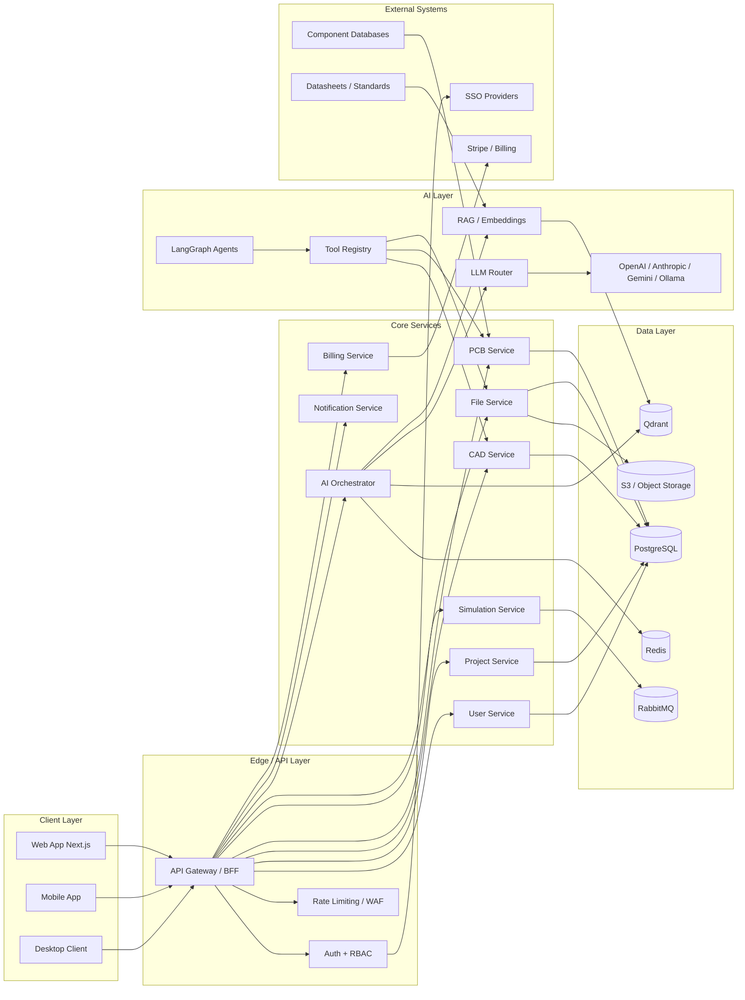

# Enginex AI — Production Architecture Blueprint

## 1. System architecture diagram



## 2. Frontend architecture

### Folder structure

```text
apps/web/
├── src/
│   ├── pages/
│   ├── components/
│   │   ├── common/
│   │   ├── auth/
│   │   ├── projects/
│   │   ├── cad/
│   │   ├── pcb/
│   │   ├── ai/
│   │   └── shared/
│   ├── modules/
│   │   ├── cad-editor/
│   │   ├── pcb-editor/
│   │   ├── ai-chat/
│   │   └── [others]/
│   ├── services/
│   ├── hooks/
│   ├── store/
│   ├── types/
│   ├── utils/
│   ├── styles/
│   └── layout/
├── public/
└── package.json
```

### State management

- Zustand for global UI, editor, project, settings, auth state
- TanStack Query for server state and synchronization
- Local state for forms, temporary selections, transient overlays

### Rendering strategy

- 2D canvas: Fabric.js or Konva for schematics and 2D editing
- 3D viewport: Three.js + React Three Fiber for assemblies and CAD solids
- Performance: LOD, instancing, occlusion culling, GPU-accelerated rendering
- Collaboration: Yjs CRDT documents per editor, WebSocket transport, presence awareness

### Key modules

- modules/cad-editor
  - Canvas.tsx
  - Toolbar.tsx
  - PropertyPanel.tsx
  - LayerPanel.tsx
  - Viewport.tsx
  - hooks/useCADEditor.ts
  - hooks/useSelection.ts
  - hooks/useUndo.ts
  - hooks/useSnapping.ts
  - store/cadStore.ts
  - services/cad-api.ts
  - services/geometry.ts
  - services/export.ts
  - types/index.ts

- modules/pcb-editor
  - components/SchematicCanvas.tsx
  - components/LayoutCanvas.tsx
  - components/DesignRulePanel.tsx
  - hooks/usePCBEditor.ts
  - services/pcb-api.ts

- modules/ai-chat
  - components/ChatPanel.tsx
  - components/AgentSwitcher.tsx
  - hooks/useAIAssistant.ts
  - services/ai-api.ts

## 3. Backend architecture

### Folder structure

```text
services/backend/
├── app/
│   ├── main.py
│   ├── config.py
│   ├── database.py
│   ├── api/
│   │   └── v1/
│   │       ├── auth/
│   │       ├── projects/
│   │       ├── cad/
│   │       ├── pcb/
│   │       ├── ai/
│   │       ├── files/
│   │       ├── users/
│   │       └── router.py
│   ├── models/
│   ├── services/
│   ├── schemas/
│   ├── tasks/
│   ├── websockets/
│   ├── cache/
│   ├── middleware/
│   ├── utils/
│   └── events/
├── migrations/
├── tests/
├── requirements.txt
└── Dockerfile
```

### API layer pattern

```python
@router.post("/projects/{project_id}/cad/sketch", tags=["CAD"])
async def create_sketch(
    project_id: UUID,
    body: CreateSketchRequest,
    current_user: User = Depends(get_current_user),
):
    sketch = await cad_service.create_sketch(project_id, body, current_user)
    await websocket_manager.broadcast(
        f"project:{project_id}",
        {"type": "sketch_created", "data": sketch.to_dict()},
    )
    return SketchResponse(**sketch)
```

### Service pattern

```python
class CADService:
    def __init__(self, db: Session, cache: RedisService, events: EventService):
        self.db = db
        self.cache = cache
        self.events = events

    async def create_sketch(self, project_id: UUID, body: CreateSketchRequest, user: User):
        # Validate permissions
        # Create sketch in DB
        # Emit event
        # Cache result
        # Return
        raise NotImplementedError
```

### WebSocket design

- Project channel: broadcast editor change events
- AI channel: stream agent response tokens
- Presence channel: cursor and selection updates

## 4. Database architecture

### Core tables

```sql
CREATE EXTENSION IF NOT EXISTS "uuid-ossp";
CREATE EXTENSION IF NOT EXISTS pgcrypto;

CREATE TYPE user_role AS ENUM ('owner', 'admin', 'member', 'viewer');
CREATE TYPE project_type AS ENUM ('cad', 'pcb', 'mixed', 'robotics');
CREATE TYPE project_status AS ENUM ('active', 'archived');
CREATE TYPE subscription_tier AS ENUM ('free', 'pro', 'enterprise');
CREATE TYPE subscription_status AS ENUM ('active', 'cancelled', 'past_due');
CREATE TYPE ai_role AS ENUM ('user', 'assistant', 'system');
CREATE TYPE audit_action AS ENUM ('login', 'create', 'update', 'delete', 'export', 'share');

CREATE TABLE users (
    id UUID PRIMARY KEY DEFAULT uuid_generate_v4(),
    email TEXT UNIQUE NOT NULL,
    password_hash TEXT NOT NULL,
    name TEXT NOT NULL,
    avatar TEXT,
    settings JSONB NOT NULL DEFAULT '{}'::jsonb,
    created_at TIMESTAMPTZ NOT NULL DEFAULT NOW(),
    updated_at TIMESTAMPTZ NOT NULL DEFAULT NOW()
);

CREATE TABLE organizations (
    id UUID PRIMARY KEY DEFAULT uuid_generate_v4(),
    name TEXT NOT NULL,
    owner_id UUID NOT NULL REFERENCES users(id) ON DELETE CASCADE,
    subscription_tier subscription_tier NOT NULL DEFAULT 'free',
    settings JSONB NOT NULL DEFAULT '{}'::jsonb,
    created_at TIMESTAMPTZ NOT NULL DEFAULT NOW(),
    updated_at TIMESTAMPTZ NOT NULL DEFAULT NOW()
);

CREATE TABLE teams (
    id UUID PRIMARY KEY DEFAULT uuid_generate_v4(),
    organization_id UUID NOT NULL REFERENCES organizations(id) ON DELETE CASCADE,
    name TEXT NOT NULL,
    members JSONB NOT NULL DEFAULT '[]'::jsonb,
    created_at TIMESTAMPTZ NOT NULL DEFAULT NOW()
);

CREATE TABLE projects (
    id UUID PRIMARY KEY DEFAULT uuid_generate_v4(),
    organization_id UUID NOT NULL REFERENCES organizations(id) ON DELETE CASCADE,
    team_id UUID REFERENCES teams(id) ON DELETE SET NULL,
    name TEXT NOT NULL,
    description TEXT,
    owner_id UUID NOT NULL REFERENCES users(id) ON DELETE CASCADE,
    type project_type NOT NULL DEFAULT 'mixed',
    status project_status NOT NULL DEFAULT 'active',
    settings JSONB NOT NULL DEFAULT '{}'::jsonb,
    created_at TIMESTAMPTZ NOT NULL DEFAULT NOW(),
    updated_at TIMESTAMPTZ NOT NULL DEFAULT NOW()
);

CREATE TABLE folders (
    id UUID PRIMARY KEY DEFAULT uuid_generate_v4(),
    project_id UUID NOT NULL REFERENCES projects(id) ON DELETE CASCADE,
    parent_id UUID REFERENCES folders(id) ON DELETE CASCADE,
    name TEXT NOT NULL,
    created_at TIMESTAMPTZ NOT NULL DEFAULT NOW()
);

CREATE TABLE files (
    id UUID PRIMARY KEY DEFAULT uuid_generate_v4(),
    project_id UUID NOT NULL REFERENCES projects(id) ON DELETE CASCADE,
    folder_id UUID REFERENCES folders(id) ON DELETE SET NULL,
    name TEXT NOT NULL,
    type TEXT NOT NULL,
    file_key TEXT NOT NULL,
    size_bytes BIGINT NOT NULL DEFAULT 0,
    version_number INT NOT NULL DEFAULT 1,
    created_by UUID NOT NULL REFERENCES users(id) ON DELETE SET NULL,
    created_at TIMESTAMPTZ NOT NULL DEFAULT NOW(),
    updated_at TIMESTAMPTZ NOT NULL DEFAULT NOW(),
    is_deleted BOOLEAN NOT NULL DEFAULT FALSE
);

CREATE TABLE cad_objects (
    id UUID PRIMARY KEY DEFAULT uuid_generate_v4(),
    file_id UUID NOT NULL REFERENCES files(id) ON DELETE CASCADE,
    object_type TEXT NOT NULL,
    name TEXT NOT NULL,
    data JSONB NOT NULL DEFAULT '{}'::jsonb,
    parent_id UUID REFERENCES cad_objects(id) ON DELETE CASCADE,
    version_number INT NOT NULL DEFAULT 1,
    created_by UUID REFERENCES users(id) ON DELETE SET NULL,
    updated_by UUID REFERENCES users(id) ON DELETE SET NULL,
    created_at TIMESTAMPTZ NOT NULL DEFAULT NOW(),
    updated_at TIMESTAMPTZ NOT NULL DEFAULT NOW()
);

CREATE TABLE pcb_boards (
    id UUID PRIMARY KEY DEFAULT uuid_generate_v4(),
    file_id UUID NOT NULL REFERENCES files(id) ON DELETE CASCADE,
    name TEXT NOT NULL,
    width_mm DOUBLE PRECISION NOT NULL DEFAULT 0,
    height_mm DOUBLE PRECISION NOT NULL DEFAULT 0,
    layers_count INT NOT NULL DEFAULT 2,
    data JSONB NOT NULL DEFAULT '{}'::jsonb,
    created_at TIMESTAMPTZ NOT NULL DEFAULT NOW(),
    updated_at TIMESTAMPTZ NOT NULL DEFAULT NOW()
);

CREATE TABLE pcb_components (
    id UUID PRIMARY KEY DEFAULT uuid_generate_v4(),
    board_id UUID NOT NULL REFERENCES pcb_boards(id) ON DELETE CASCADE,
    reference_designator TEXT NOT NULL,
    footprint_id UUID,
    library_entry_id UUID,
    position_x DOUBLE PRECISION NOT NULL DEFAULT 0,
    position_y DOUBLE PRECISION NOT NULL DEFAULT 0,
    rotation_degrees DOUBLE PRECISION NOT NULL DEFAULT 0,
    data JSONB NOT NULL DEFAULT '{}'::jsonb,
    created_at TIMESTAMPTZ NOT NULL DEFAULT NOW(),
    updated_at TIMESTAMPTZ NOT NULL DEFAULT NOW()
);

CREATE TABLE layers (
    id UUID PRIMARY KEY DEFAULT uuid_generate_v4(),
    file_id UUID NOT NULL REFERENCES files(id) ON DELETE CASCADE,
    name TEXT NOT NULL,
    layer_type TEXT NOT NULL,
    visible BOOLEAN NOT NULL DEFAULT TRUE,
    color TEXT NOT NULL DEFAULT '#000000',
    order_index INT NOT NULL DEFAULT 0,
    created_at TIMESTAMPTZ NOT NULL DEFAULT NOW()
);

CREATE TABLE ai_chats (
    id UUID PRIMARY KEY DEFAULT uuid_generate_v4(),
    project_id UUID REFERENCES projects(id) ON DELETE CASCADE,
    user_id UUID NOT NULL REFERENCES users(id) ON DELETE CASCADE,
    title TEXT NOT NULL,
    created_at TIMESTAMPTZ NOT NULL DEFAULT NOW(),
    updated_at TIMESTAMPTZ NOT NULL DEFAULT NOW()
);

CREATE TABLE ai_messages (
    id UUID PRIMARY KEY DEFAULT uuid_generate_v4(),
    chat_id UUID NOT NULL REFERENCES ai_chats(id) ON DELETE CASCADE,
    role ai_role NOT NULL,
    content TEXT NOT NULL,
    tool_calls JSONB NOT NULL DEFAULT '[]'::jsonb,
    model_used TEXT,
    tokens_used INT NOT NULL DEFAULT 0,
    cost_usd NUMERIC(12, 6) NOT NULL DEFAULT 0,
    created_at TIMESTAMPTZ NOT NULL DEFAULT NOW()
);

CREATE TABLE ai_agents (
    id UUID PRIMARY KEY DEFAULT uuid_generate_v4(),
    name TEXT NOT NULL,
    role TEXT NOT NULL,
    prompt TEXT NOT NULL,
    tools JSONB NOT NULL DEFAULT '[]'::jsonb,
    memory_enabled BOOLEAN NOT NULL DEFAULT TRUE,
    created_at TIMESTAMPTZ NOT NULL DEFAULT NOW()
);

CREATE TABLE agent_memory (
    id UUID PRIMARY KEY DEFAULT uuid_generate_v4(),
    agent_id UUID NOT NULL REFERENCES ai_agents(id) ON DELETE CASCADE,
    chat_id UUID REFERENCES ai_chats(id) ON DELETE CASCADE,
    key TEXT NOT NULL,
    value JSONB NOT NULL DEFAULT '{}'::jsonb,
    expires_at TIMESTAMPTZ,
    created_at TIMESTAMPTZ NOT NULL DEFAULT NOW()
);

CREATE TABLE subscriptions (
    id UUID PRIMARY KEY DEFAULT uuid_generate_v4(),
    organization_id UUID NOT NULL REFERENCES organizations(id) ON DELETE CASCADE,
    tier subscription_tier NOT NULL DEFAULT 'free',
    status subscription_status NOT NULL DEFAULT 'active',
    stripe_subscription_id TEXT,
    started_at TIMESTAMPTZ NOT NULL DEFAULT NOW(),
    ended_at TIMESTAMPTZ,
    auto_renew BOOLEAN NOT NULL DEFAULT TRUE
);

CREATE TABLE api_keys (
    id UUID PRIMARY KEY DEFAULT uuid_generate_v4(),
    user_id UUID NOT NULL REFERENCES users(id) ON DELETE CASCADE,
    provider TEXT NOT NULL,
    encrypted_key TEXT NOT NULL,
    is_active BOOLEAN NOT NULL DEFAULT TRUE,
    created_at TIMESTAMPTZ NOT NULL DEFAULT NOW(),
    last_used_at TIMESTAMPTZ
);

CREATE TABLE usage_logs (
    id UUID PRIMARY KEY DEFAULT uuid_generate_v4(),
    organization_id UUID NOT NULL REFERENCES organizations(id) ON DELETE CASCADE,
    user_id UUID REFERENCES users(id) ON DELETE SET NULL,
    operation TEXT NOT NULL,
    resource_id UUID,
    tokens_used INT NOT NULL DEFAULT 0,
    cost_usd NUMERIC(12, 6) NOT NULL DEFAULT 0,
    created_at TIMESTAMPTZ NOT NULL DEFAULT NOW()
);

CREATE TABLE audit_logs (
    id UUID PRIMARY KEY DEFAULT uuid_generate_v4(),
    user_id UUID REFERENCES users(id) ON DELETE SET NULL,
    action audit_action NOT NULL,
    resource_type TEXT NOT NULL,
    resource_id UUID,
    details JSONB NOT NULL DEFAULT '{}'::jsonb,
    ip_address INET,
    created_at TIMESTAMPTZ NOT NULL DEFAULT NOW()
);

CREATE INDEX idx_files_project_id ON files(project_id);
CREATE INDEX idx_projects_organization_id ON projects(organization_id);
CREATE INDEX idx_cad_objects_file_id ON cad_objects(file_id);
CREATE INDEX idx_ai_messages_chat_id ON ai_messages(chat_id);
CREATE INDEX idx_usage_logs_org_date ON usage_logs(organization_id, created_at);
CREATE INDEX idx_audit_logs_user_created ON audit_logs(user_id, created_at);
```

## 5. API specification (OpenAPI 3.0)

```yaml
openapi: 3.0.3
info:
  title: Enginex AI API
  version: 1.0.0
servers:
  - url: https://api.enginex.ai
paths:
  /api/v1/auth/register:
    post:
      summary: Register a user
      requestBody:
        required: true
        content:
          application/json:
            schema:
              type: object
              required: [email, password, name]
              properties:
                email:
                  type: string
                password:
                  type: string
                name:
                  type: string
      responses:
        '201':
          description: Created

  /api/v1/projects:
    get:
      summary: List projects
      security:
        - bearerAuth: []
      responses:
        '200':
          description: OK
    post:
      summary: Create project
      security:
        - bearerAuth: []
      responses:
        '201':
          description: Created

  /api/v1/projects/{project_id}/cad/sketch:
    post:
      summary: Create a sketch
      security:
        - bearerAuth: []
      parameters:
        - in: path
          name: project_id
          required: true
          schema:
            type: string
      responses:
        '201':
          description: Created

  /api/v1/projects/{project_id}/pcb/board:
    post:
      summary: Create a PCB board
      security:
        - bearerAuth: []
      responses:
        '201':
          description: Created

  /api/v1/ai/chats:
    get:
      summary: List AI chats
      security:
        - bearerAuth: []
      responses:
        '200':
          description: OK
    post:
      summary: Create AI chat
      security:
        - bearerAuth: []
      responses:
        '201':
          description: Created

  /api/v1/ai/chats/{chat_id}/messages:
    post:
      summary: Send message to AI assistant
      security:
        - bearerAuth: []
      responses:
        '200':
          description: OK

  /ws/projects/{project_id}:
    get:
      summary: Project real-time stream
      responses:
        '101':
          description: Switching Protocols
components:
  securitySchemes:
    bearerAuth:
      type: http
      scheme: bearer
      bearerFormat: JWT
```

## 6. Component design

### Core React components

```ts
interface ChatPanelProps {
  chatId: string;
  messages: Message[];
  onSendMessage: (content: string) => Promise<void>;
  isStreaming: boolean;
}

function ChatPanel({ chatId, messages, onSendMessage, isStreaming }: ChatPanelProps) {
  return <div className="chat-panel" />;
}
```

### Recommended hooks

- useCADEditor: editor state, commands, selection, viewport
- useSelection: selection management and derived properties
- useUndo: command history and redo/undo
- useSnapping: coordinate snapping and constraint guidance
- useAIAssistant: chat state, streaming responses, tool invocation

### UI module boundaries

- Auth and onboarding remain in shared shell
- CAD, PCB, and AI modules own their local state and APIs
- Cross-module orchestration happens via composition and shared services

## 7. Service layer

### Core services

```python
class AuthService:
    async def register(self, email: str, password: str, name: str) -> User:
        raise NotImplementedError

    async def login(self, email: str, password: str) -> dict:
        raise NotImplementedError

    async def refresh_token(self, refresh_token: str) -> dict:
        raise NotImplementedError
```

```python
class ProjectService:
    async def create_project(self, payload: dict, user: User) -> Project:
        raise NotImplementedError

    async def share_project(self, project_id: UUID, user_ids: list[UUID]) -> None:
        raise NotImplementedError
```

```python
class CADService:
    async def create_sketch(self, project_id: UUID, body: dict, user: User) -> dict:
        raise NotImplementedError

    async def extrude(self, sketch_id: UUID, body: dict) -> dict:
        raise NotImplementedError
```

```python
class PCBService:
    async def create_board(self, project_id: UUID, payload: dict, user: User) -> dict:
        raise NotImplementedError

    async def place_component(self, board_id: UUID, payload: dict) -> dict:
        raise NotImplementedError
```

### Error handling expectations

- Domain errors return structured 4xx/5xx codes
- All services log correlation IDs
- Background jobs emit events and retry policies
- Business rules are validated before writes to the main database

## 8. AI architecture

### Provider abstraction

```python
class AIProvider(Enum):
    OPENAI = "openai"
    ANTHROPIC = "anthropic"
    GEMINI = "gemini"
    OLLAMA = "ollama"
    GROQ = "groq"
    TOGETHER = "together"
    OPENROUTER = "openrouter"
```

### Agent definitions

- PlannerAgent
  - Input: user request and project context
  - Output: subtask plan with assigned specialized agent
  - Uses intent classification and retrieval

- MechanicalCADAgent
  - Handles sketching, feature creation, parametric modeling
  - Executes CAD tools such as create_sketch, extrude, fillet

- PCBDesignAgent
  - Handles component placement, routing suggestions, DRC checks
  - Executes place_component, route_trace, run_drc

- ElectronicsAgent
  - Reviews circuits, suggests parts, analyzes topology
  - Uses datasheet and standards retrieval

- SimulationAgent
  - Runs FEA, SPICE, motion, thermal analyses as async jobs

- FirmwareAgent
  - Generates embedded code and board support packages

- ManufacturingAgent
  - Selects materials, estimates cost, plans fabrication steps

- DesignReviewAgent
  - Checks compliance, safety, manufacturability, and quality

- DocumentationAgent
  - Produces design notes, BOM summaries, and release docs

### Tool registry example

```python
tool_registry = {
    "create_sketch": CreateSketchTool(),
    "extrude": ExtrudeTool(),
    "place_component": PlaceComponentTool(),
    "search_datasheets": SearchDatasheetsTool(),
}
```

### RAG workflow

1. Ingest datasheets, standards, application notes, and internal documentation
2. Generate embeddings and store them in Qdrant
3. Retrieve top-k results for each user request
4. Inject retrieved context into the agent graph for grounded responses

## 9. Deployment architecture

### Docker compose

Use the compose file in [docker-compose.yml](docker-compose.yml).

### Kubernetes considerations

- Backend deployment with 3 replicas and autoscaling
- Frontend deployment with CDN-backed static assets
- PostgreSQL, Redis, RabbitMQ, and object storage managed separately in production
- Health checks, readiness probes, and pod anti-affinity for resilience

## 10. Security architecture

### Authentication and authorization

- JWT access tokens with refresh token rotation
- OAuth for Google and GitHub
- RBAC: owner/admin/member/viewer
- Protected routes require authenticated context

### Data security

- Encrypt API keys at rest using a KMS-backed secret store
- TLS everywhere
- Per-domain CORS policy
- Rate limiting and WAF rules
- Audit events for every mutating action

### Audit logging

```python
async def log_audit(user_id: UUID, action: str, resource_id: UUID, details: dict):
    audit_log = AuditLog(
        user_id=user_id,
        action=action,
        resource_id=resource_id,
        details=details,
        ip_address=request.client.host,
    )
    db.add(audit_log)
    await db.commit()
```

## 11. Development roadmap

### Phase 1 — Foundation

- Monorepo structure and project conventions
- PostgreSQL, Redis, RabbitMQ, object storage
- Authentication, API scaffolding, frontend shell

### Phase 2 — Core editors

- 2D CAD and PCB schematic editing
- 3D viewport and basic assemblies
- File management and versioning
- Real-time collaboration via Yjs and WebSocket

### Phase 3 — AI system

- Multi-provider LLM router
- LangGraph agents
- Tool registry and RAG
- Agent memory and usage tracking

### Phase 4 — Advanced engineering workflows

- Simulation, manufacturing planning, firmware generation
- Advanced PCB layout automation and design rule checks
- BOM generation and release documentation

### Phase 5 — Production hardening

- Load testing, SRE monitoring, security review
- Kubernetes rollout, autoscaling, disaster recovery
- Compliance, observability, and enterprise support

## Quality gates

- Unit test coverage above 80%
- Integration tests for all primary APIs
- Load tests for 1,000 concurrent users
- Security review aligned to OWASP Top 10
- P95 latency budgets and uptime monitoring
- Documentation reviewed before release
