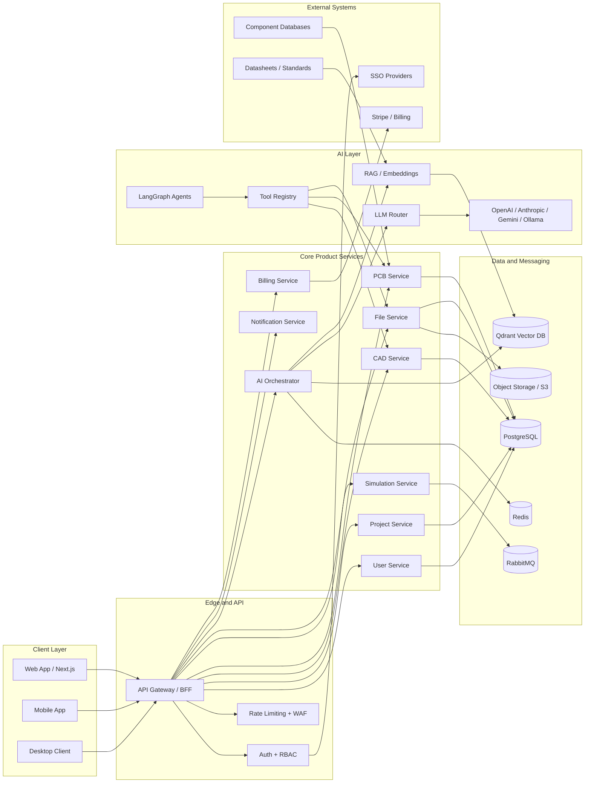

# Enginex AI — Production Architecture Blueprint

## 1. System architecture overview

Enginex AI is an AI-native engineering platform for CAD, PCB design, simulation, and collaboration. The architecture below is organized so the platform can scale from a startup team to global enterprises while keeping domain workflows fast, secure, and observable.

### System diagram



## 2. Frontend architecture

### Folder structure

```text
apps/web/
├── src/
│   ├── pages/               # Next.js route pages
│   ├── components/          # Reusable domain components
│   │   ├── common/
│   │   ├── auth/
│   │   ├── projects/
│   │   ├── cad/
│   │   ├── pcb/
│   │   ├── ai/
│   │   └── shared/
│   ├── modules/             # Feature modules
│   │   ├── cad-editor/
│   │   ├── pcb-editor/
│   │   ├── ai-chat/
│   │   └── [others]/
│   ├── services/            # API clients, WebSocket, storage
│   ├── hooks/               # Shared React hooks
│   ├── store/               # Zustand stores
│   ├── types/               # TypeScript models
│   ├── utils/               # Geometry, math, formatting
│   ├── styles/              # Global styles and Tailwind setup
│   └── layout/              # App shell, sidebars, toolbars
├── public/
└── [config files]
```

### State management strategy

- Zustand manages auth, project context, editor state, UI state, and settings.
- TanStack Query handles server data, cache refresh, and optimistic updates.
- Local state remains limited to form values, transient selection, and overlays.

### Rendering and collaboration

- Fabric.js or Konva powers 2D CAD and PCB schematic canvases.
- Three.js with React Three Fiber powers 3D assemblies and viewport navigation.
- WebGL rendering supports millions of vertices with LOD, occlusion culling, and instancing.
- Each document has a Yjs CRDT state and uses a WebSocket transport for presence and change propagation.

### Core modules

- modules/cad-editor
  - Canvas.tsx
  - Toolbar.tsx
  - PropertyPanel.tsx
  - LayerPanel.tsx
  - Viewport.tsx
  - hooks/useCADEditor.ts
  - hooks/useSelection.ts
  - hooks/useUndo.ts
  - hooks/useSnapping.ts
  - store/cadStore.ts
  - services/cad-api.ts
  - services/geometry.ts
  - services/export.ts
  - types/index.ts

- modules/pcb-editor
  - components/SchematicCanvas.tsx
  - components/LayoutCanvas.tsx
  - components/DesignRulePanel.tsx
  - hooks/usePCBEditor.ts
  - services/pcb-api.ts

- modules/ai-chat
  - components/ChatPanel.tsx
  - components/AgentSwitcher.tsx
  - hooks/useAIAssistant.ts
  - services/ai-api.ts

## 3. Backend architecture

### Folder structure

```text
services/backend/
├── app/
│   ├── main.py
│   ├── config.py
│   ├── database.py
│   ├── api/
│   │   └── v1/
│   │       ├── auth/
│   │       ├── projects/
│   │       ├── cad/
│   │       ├── pcb/
│   │       ├── ai/
│   │       ├── files/
│   │       ├── users/
│   │       └── router.py
│   ├── models/
│   ├── services/
│   ├── schemas/
│   ├── tasks/
│   ├── websockets/
│   ├── cache/
│   ├── middleware/
│   ├── utils/
│   └── events/
├── migrations/
├── tests/
├── requirements.txt
└── Dockerfile
```

### API layer pattern

```python
@router.post("/projects/{project_id}/cad/sketch", tags=["CAD"])
async def create_sketch(
    project_id: UUID,
    body: CreateSketchRequest,
    current_user: User = Depends(get_current_user),
):
    sketch = await cad_service.create_sketch(project_id, body, current_user)
    await websocket_manager.broadcast(
        f"project:{project_id}",
        {"type": "sketch_created", "data": sketch.to_dict()},
    )
    return SketchResponse(**sketch)
```

### Service layer pattern

```python
class CADService:
    def __init__(self, db: Session, cache: RedisService, events: EventService):
        self.db = db
        self.cache = cache
        self.events = events

    async def create_sketch(self, project_id: UUID, body: CreateSketchRequest, user: User):
        # Validate permissions
        # Create sketch in DB
        # Emit event
        # Cache result
        # Return
        raise NotImplementedError
```

### WebSocket design

- Project channel: broadcast editor change events.
- AI channel: stream agent response tokens.
- Presence channel: cursor and selection updates.

## 4. Database architecture

The relational core stores identity, projects, files, design artifacts, AI interactions, and billing metadata. JSONB is used for flexible design-specific payloads such as geometry parameters, board settings, and tool call records.

### Core tables

```sql
CREATE EXTENSION IF NOT EXISTS "uuid-ossp";
CREATE EXTENSION IF NOT EXISTS pgcrypto;

CREATE TYPE project_type AS ENUM ('cad', 'pcb', 'mixed', 'robotics');
CREATE TYPE project_status AS ENUM ('active', 'archived');
CREATE TYPE subscription_tier AS ENUM ('free', 'pro', 'enterprise');
CREATE TYPE subscription_status AS ENUM ('active', 'cancelled', 'past_due');
CREATE TYPE ai_role AS ENUM ('user', 'assistant', 'system');
CREATE TYPE audit_action AS ENUM ('login', 'create', 'update', 'delete', 'export', 'share');

CREATE TABLE users (
    id UUID PRIMARY KEY DEFAULT uuid_generate_v4(),
    email TEXT UNIQUE NOT NULL,
    password_hash TEXT NOT NULL,
    name TEXT NOT NULL,
    avatar TEXT,
    settings JSONB NOT NULL DEFAULT '{}'::jsonb,
    created_at TIMESTAMPTZ NOT NULL DEFAULT NOW(),
    updated_at TIMESTAMPTZ NOT NULL DEFAULT NOW()
);

CREATE TABLE organizations (
    id UUID PRIMARY KEY DEFAULT uuid_generate_v4(),
    name TEXT NOT NULL,
    owner_id UUID NOT NULL REFERENCES users(id) ON DELETE CASCADE,
    subscription_tier subscription_tier NOT NULL DEFAULT 'free',
    settings JSONB NOT NULL DEFAULT '{}'::jsonb,
    created_at TIMESTAMPTZ NOT NULL DEFAULT NOW(),
    updated_at TIMESTAMPTZ NOT NULL DEFAULT NOW()
);

CREATE TABLE teams (
    id UUID PRIMARY KEY DEFAULT uuid_generate_v4(),
    organization_id UUID NOT NULL REFERENCES organizations(id) ON DELETE CASCADE,
    name TEXT NOT NULL,
    members JSONB NOT NULL DEFAULT '[]'::jsonb,
    created_at TIMESTAMPTZ NOT NULL DEFAULT NOW()
);

CREATE TABLE projects (
    id UUID PRIMARY KEY DEFAULT uuid_generate_v4(),
    organization_id UUID NOT NULL REFERENCES organizations(id) ON DELETE CASCADE,
    team_id UUID REFERENCES teams(id) ON DELETE SET NULL,
    name TEXT NOT NULL,
    description TEXT,
    owner_id UUID NOT NULL REFERENCES users(id) ON DELETE CASCADE,
    type project_type NOT NULL DEFAULT 'mixed',
    status project_status NOT NULL DEFAULT 'active',
    settings JSONB NOT NULL DEFAULT '{}'::jsonb,
    created_at TIMESTAMPTZ NOT NULL DEFAULT NOW(),
    updated_at TIMESTAMPTZ NOT NULL DEFAULT NOW()
);

CREATE TABLE folders (
    id UUID PRIMARY KEY DEFAULT uuid_generate_v4(),
    project_id UUID NOT NULL REFERENCES projects(id) ON DELETE CASCADE,
    parent_id UUID REFERENCES folders(id) ON DELETE CASCADE,
    name TEXT NOT NULL,
    created_at TIMESTAMPTZ NOT NULL DEFAULT NOW()
);

CREATE TABLE files (
    id UUID PRIMARY KEY DEFAULT uuid_generate_v4(),
    project_id UUID NOT NULL REFERENCES projects(id) ON DELETE CASCADE,
    folder_id UUID REFERENCES folders(id) ON DELETE SET NULL,
    name TEXT NOT NULL,
    type TEXT NOT NULL,
    file_key TEXT NOT NULL,
    size_bytes BIGINT NOT NULL DEFAULT 0,
    version_number INT NOT NULL DEFAULT 1,
    created_by UUID NOT NULL REFERENCES users(id) ON DELETE SET NULL,
    created_at TIMESTAMPTZ NOT NULL DEFAULT NOW(),
    updated_at TIMESTAMPTZ NOT NULL DEFAULT NOW(),
    is_deleted BOOLEAN NOT NULL DEFAULT FALSE
);

CREATE TABLE cad_objects (
    id UUID PRIMARY KEY DEFAULT uuid_generate_v4(),
    file_id UUID NOT NULL REFERENCES files(id) ON DELETE CASCADE,
    object_type TEXT NOT NULL,
    name TEXT NOT NULL,
    data JSONB NOT NULL DEFAULT '{}'::jsonb,
    parent_id UUID REFERENCES cad_objects(id) ON DELETE CASCADE,
    version_number INT NOT NULL DEFAULT 1,
    created_by UUID REFERENCES users(id) ON DELETE SET NULL,
    updated_by UUID REFERENCES users(id) ON DELETE SET NULL,
    created_at TIMESTAMPTZ NOT NULL DEFAULT NOW(),
    updated_at TIMESTAMPTZ NOT NULL DEFAULT NOW()
);

CREATE TABLE pcb_boards (
    id UUID PRIMARY KEY DEFAULT uuid_generate_v4(),
    file_id UUID NOT NULL REFERENCES files(id) ON DELETE CASCADE,
    name TEXT NOT NULL,
    width_mm DOUBLE PRECISION NOT NULL DEFAULT 0,
    height_mm DOUBLE PRECISION NOT NULL DEFAULT 0,
    layers_count INT NOT NULL DEFAULT 2,
    data JSONB NOT NULL DEFAULT '{}'::jsonb,
    created_at TIMESTAMPTZ NOT NULL DEFAULT NOW(),
    updated_at TIMESTAMPTZ NOT NULL DEFAULT NOW()
);

CREATE TABLE pcb_components (
    id UUID PRIMARY KEY DEFAULT uuid_generate_v4(),
    board_id UUID NOT NULL REFERENCES pcb_boards(id) ON DELETE CASCADE,
    reference_designator TEXT NOT NULL,
    footprint_id UUID,
    library_entry_id UUID,
    position_x DOUBLE PRECISION NOT NULL DEFAULT 0,
    position_y DOUBLE PRECISION NOT NULL DEFAULT 0,
    rotation_degrees DOUBLE PRECISION NOT NULL DEFAULT 0,
    data JSONB NOT NULL DEFAULT '{}'::jsonb,
    created_at TIMESTAMPTZ NOT NULL DEFAULT NOW(),
    updated_at TIMESTAMPTZ NOT NULL DEFAULT NOW()
);

CREATE TABLE layers (
    id UUID PRIMARY KEY DEFAULT uuid_generate_v4(),
    file_id UUID NOT NULL REFERENCES files(id) ON DELETE CASCADE,
    name TEXT NOT NULL,
    layer_type TEXT NOT NULL,
    visible BOOLEAN NOT NULL DEFAULT TRUE,
    color TEXT NOT NULL DEFAULT '#000000',
    order_index INT NOT NULL DEFAULT 0,
    created_at TIMESTAMPTZ NOT NULL DEFAULT NOW()
);

CREATE TABLE ai_chats (
    id UUID PRIMARY KEY DEFAULT uuid_generate_v4(),
    project_id UUID REFERENCES projects(id) ON DELETE CASCADE,
    user_id UUID NOT NULL REFERENCES users(id) ON DELETE CASCADE,
    title TEXT NOT NULL,
    created_at TIMESTAMPTZ NOT NULL DEFAULT NOW(),
    updated_at TIMESTAMPTZ NOT NULL DEFAULT NOW()
);

CREATE TABLE ai_messages (
    id UUID PRIMARY KEY DEFAULT uuid_generate_v4(),
    chat_id UUID NOT NULL REFERENCES ai_chats(id) ON DELETE CASCADE,
    role ai_role NOT NULL,
    content TEXT NOT NULL,
    tool_calls JSONB NOT NULL DEFAULT '[]'::jsonb,
    model_used TEXT,
    tokens_used INT NOT NULL DEFAULT 0,
    cost_usd NUMERIC(12, 6) NOT NULL DEFAULT 0,
    created_at TIMESTAMPTZ NOT NULL DEFAULT NOW()
);

CREATE TABLE ai_agents (
    id UUID PRIMARY KEY DEFAULT uuid_generate_v4(),
    name TEXT NOT NULL,
    role TEXT NOT NULL,
    prompt TEXT NOT NULL,
    tools JSONB NOT NULL DEFAULT '[]'::jsonb,
    memory_enabled BOOLEAN NOT NULL DEFAULT TRUE,
    created_at TIMESTAMPTZ NOT NULL DEFAULT NOW()
);

CREATE TABLE agent_memory (
    id UUID PRIMARY KEY DEFAULT uuid_generate_v4(),
    agent_id UUID NOT NULL REFERENCES ai_agents(id) ON DELETE CASCADE,
    chat_id UUID REFERENCES ai_chats(id) ON DELETE CASCADE,
    key TEXT NOT NULL,
    value JSONB NOT NULL DEFAULT '{}'::jsonb,
    expires_at TIMESTAMPTZ,
    created_at TIMESTAMPTZ NOT NULL DEFAULT NOW()
);

CREATE TABLE subscriptions (
    id UUID PRIMARY KEY DEFAULT uuid_generate_v4(),
    organization_id UUID NOT NULL REFERENCES organizations(id) ON DELETE CASCADE,
    tier subscription_tier NOT NULL DEFAULT 'free',
    status subscription_status NOT NULL DEFAULT 'active',
    stripe_subscription_id TEXT,
    started_at TIMESTAMPTZ NOT NULL DEFAULT NOW(),
    ended_at TIMESTAMPTZ,
    auto_renew BOOLEAN NOT NULL DEFAULT TRUE
);

CREATE TABLE api_keys (
    id UUID PRIMARY KEY DEFAULT uuid_generate_v4(),
    user_id UUID NOT NULL REFERENCES users(id) ON DELETE CASCADE,
    provider TEXT NOT NULL,
    encrypted_key TEXT NOT NULL,
    is_active BOOLEAN NOT NULL DEFAULT TRUE,
    created_at TIMESTAMPTZ NOT NULL DEFAULT NOW(),
    last_used_at TIMESTAMPTZ
);

CREATE TABLE usage_logs (
    id UUID PRIMARY KEY DEFAULT uuid_generate_v4(),
    organization_id UUID NOT NULL REFERENCES organizations(id) ON DELETE CASCADE,
    user_id UUID REFERENCES users(id) ON DELETE SET NULL,
    operation TEXT NOT NULL,
    resource_id UUID,
    tokens_used INT NOT NULL DEFAULT 0,
    cost_usd NUMERIC(12, 6) NOT NULL DEFAULT 0,
    created_at TIMESTAMPTZ NOT NULL DEFAULT NOW()
);

CREATE TABLE audit_logs (
    id UUID PRIMARY KEY DEFAULT uuid_generate_v4(),
    user_id UUID REFERENCES users(id) ON DELETE SET NULL,
    action audit_action NOT NULL,
    resource_type TEXT NOT NULL,
    resource_id UUID,
    details JSONB NOT NULL DEFAULT '{}'::jsonb,
    ip_address INET,
    created_at TIMESTAMPTZ NOT NULL DEFAULT NOW()
);

CREATE INDEX idx_files_project_id ON files(project_id);
CREATE INDEX idx_projects_organization_id ON projects(organization_id);
CREATE INDEX idx_cad_objects_file_id ON cad_objects(file_id);
CREATE INDEX idx_ai_messages_chat_id ON ai_messages(chat_id);
CREATE INDEX idx_agent_memory_agent_id ON agent_memory(agent_id);
CREATE INDEX idx_usage_logs_org_date ON usage_logs(organization_id, created_at);
CREATE INDEX idx_audit_logs_user_created ON audit_logs(user_id, created_at);
```

## 5. AI architecture

### Provider abstraction

- The AI layer uses a provider-aware router with fallback logic, cost controls, token tracking, and per-tenant configuration.
- Supported providers include OpenAI, Anthropic, Gemini, Ollama, Groq, Together, and OpenRouter.
- Routing considers latency, budget, model capability, and data residency policies.

### Agent system

- PlannerAgent breaks high-level requests into work items.
- MechanicalCADAgent creates parametric features and geometry operations.
- PCBDesignAgent suggests layouts and routing heuristics.
- ElectronicsAgent evaluates circuits and component compatibility.
- SimulationAgent executes FEA, SPICE, or motion analysis jobs.
- FirmwareAgent writes embedded C/C++ or Rust code.
- ManufacturingAgent estimates BOM cost and assembly feasibility.
- DesignReviewAgent performs QA, DRC, and release checks.
- DocumentationAgent creates design notes, user guides, and manufacturing handoffs.

### Tool system

- Agents call typed tools for CAD edits, PCB placement, file access, datasheet search, export operations, and project context retrieval.
- Tools are registered centrally and executed with permission checks and audit logging.

### RAG

- Vector search over datasheets, standards, internal documents, and component knowledge is stored in Qdrant.
- Embeddings are refreshed on document ingestion and versioned by project and tenant.

## 6. Deployment architecture

### Containerization

- Backend services are deployed as FastAPI instances behind a load balancer.
- Frontend is served by a Next.js origin and optionally a CDN cache.
- Async workers process export, simulation, and AI jobs through Celery and RabbitMQ.
- PostgreSQL, Redis, RabbitMQ, object storage, and a vector database form the data plane.

### Production targets

- 3+ backend replicas per region.
- Autoscaling on CPU, queue depth, and WebSocket connection count.
- Health checks and readiness probes for zero-downtime deploys.
- Centralized logging, tracing, metrics, and alerts through OpenTelemetry and Prometheus/Grafana.

## 7. Security architecture

- JWT access tokens and refresh tokens with rotation and short expiration windows.
- CSRF protections for browser requests and signed file URLs for object storage access.
- Encryption at rest for API keys and secrets using KMS-managed keys.
- Role-based access control at organization, project, and artifact levels.
- Audit logging for login, create, update, delete, share, and export actions.

## 8. Delivery roadmap

### Phase 1 — Foundation

- repository scaffold, database migrations, auth, baseline API, web shell

### Phase 2 — Core editors

- 2D CAD, 3D viewport, PCB schematic, real-time sync, file management

### Phase 3 — AI platform

- model router, LangGraph agents, RAG, tool registry, streaming responses

### Phase 4 — Advanced engineering

- simulation, firmware generation, assembly modeling, advanced PCB rules

### Phase 5 — Production hardening

- performance tuning, SLO monitoring, security audits, cost controls, and compliance
